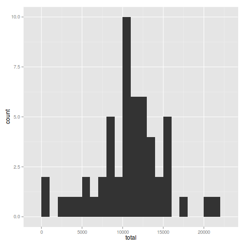
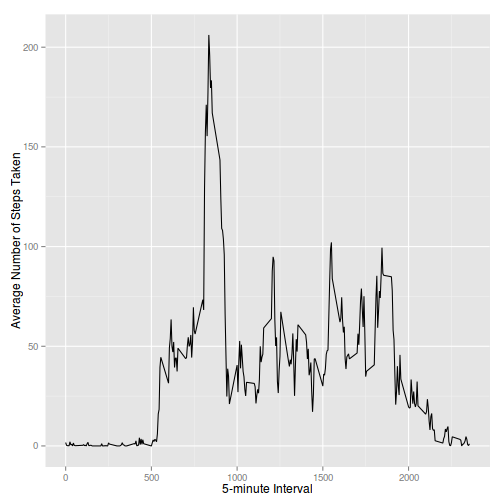
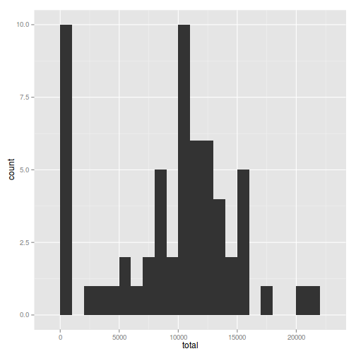
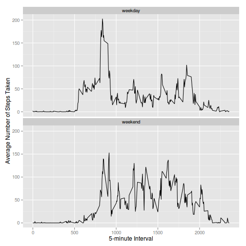

# Reproducible Research: Peer Assessment 1


## Loading and preprocessing the data

First load in the libraries that will be used:


```r
library(ggplot2)
library(plyr)
```


Ensure that the CSV file has been unzipped and then read it into an `activity`
variable:


```r
if (!file.exists("activity.csv")) {
    unzip("activity.zip")
}
activity <- read.csv("activity.csv")
```


Create a dataframe that stores the total number of steps taken per day:


```r
totalByDay <- ddply(activity, .(date), summarize, total = sum(steps))
```


Create another dataframe that stores the average number of steps taken in each 
5-minute interval:


```r
avgByInterval <- ddply(activity, .(interval), summarize, avg = mean(steps, na.rm = TRUE))
```


## What is mean total number of steps taken per day?

Plot a histogram of the total number of steps taken each day:


```r
qplot(total, data = totalByDay, binwidth = 1000)
```

 


Determine the mean total number of steps taken per day:


```r
mean(totalByDay$total, na.rm = TRUE)
```

```
## [1] 10766
```


Determine the median total number of steps taken per day:


```r
median(totalByDay$total, na.rm = TRUE)
```

```
## [1] 10765
```


## What is the average daily activity pattern?

Construct a time series plot of the average number of steps taken, averaged 
across all days, against the 5-minute intervals:


```r
ggplot(avgByInterval, aes(interval, avg)) + geom_line() + xlab("5-minute Interval") + 
    ylab("Average Number of Steps Taken")
```

 


Determine the 5-minute interval in which, on average, the maximum number of 
steps was taken:


```r
maxAvg = max(avgByInterval$avg)
avgByInterval[avgByInterval$avg == maxAvg, ]$interval
```

```
## [1] 835
```


So 8:35-8:40 am is when, on average, the maximum number of steps were taken.

## Imputing missing values

The total number of missing values in the dataset is:


```r
sum(is.na(activity))
```

```
## [1] 2304
```


To impute the missing values, create a new dataframe with the NA values in the 
`steps` column replaced with the median number of steps for that 5-minute 
interval:


```r
newActivity <- activity
newActivity$steps <- with(activity, ifelse(is.na(steps), median(activity[activity$interval == 
    interval, 1], na.rm = TRUE), steps))
```


Create a dataframe that stores the total number of steps taken per day based
on the newly imputed data:


```r
newTotalByDay <- ddply(newActivity, .(date), summarize, total = sum(steps))
```


Plot a histogram of the total number of steps taken each day based
on the newly imputed data:


```r
qplot(total, data = newTotalByDay, binwidth = 1000)
```

 


Determine the mean total number of steps taken per day based
on the newly imputed data:


```r
mean(newTotalByDay$total, na.rm = TRUE)
```

```
## [1] 9354
```


Determine the median total number of steps taken per day based
on the newly imputed data:


```r
median(newTotalByDay$total, na.rm = TRUE)
```

```
## [1] 10395
```


Because the NA values have been replaced with the median number of steps for 
the given 5-minute interval, there are many more 0 values than there were 
before imputing the values. Both the mean and median are therefore lower and 
the histogram shows a much higher spike at 0.

## Are there differences in activity patterns between weekdays and weekends?

Add a `weekday`/`weekend` factor variable column to the dataframe with the 
imputed values:


```r
weekend <- c("Saturday", "Sunday")
newActivity$weekdayType <- ifelse(weekdays(as.Date(newActivity$date)) %in% weekend, 
    "weekend", "weekday")
```


Create another dataframe that stores the average number of steps taken in each 
5-minute interval based on the imputed dataset:


```r
newAvgByInterval <- ddply(newActivity, c("interval", "weekdayType"), summarize, 
    avg = mean(steps, na.rm = TRUE))
```


Construct a time series plot of the average number of steps taken, averaged 
across all days, against the 5-minute intervals, separated by weekdays and
weekends:


```r
ggplot(newAvgByInterval, aes(interval, avg)) + geom_line() + facet_wrap(~weekdayType, 
    ncol = 1) + xlab("5-minute Interval") + ylab("Average Number of Steps Taken")
```

 


The plots show that on weekdays the activity tends to begin earlier than on 
weekends, and that average number of steps taken in the morning tends to reach 
a higher value on weekdays.
